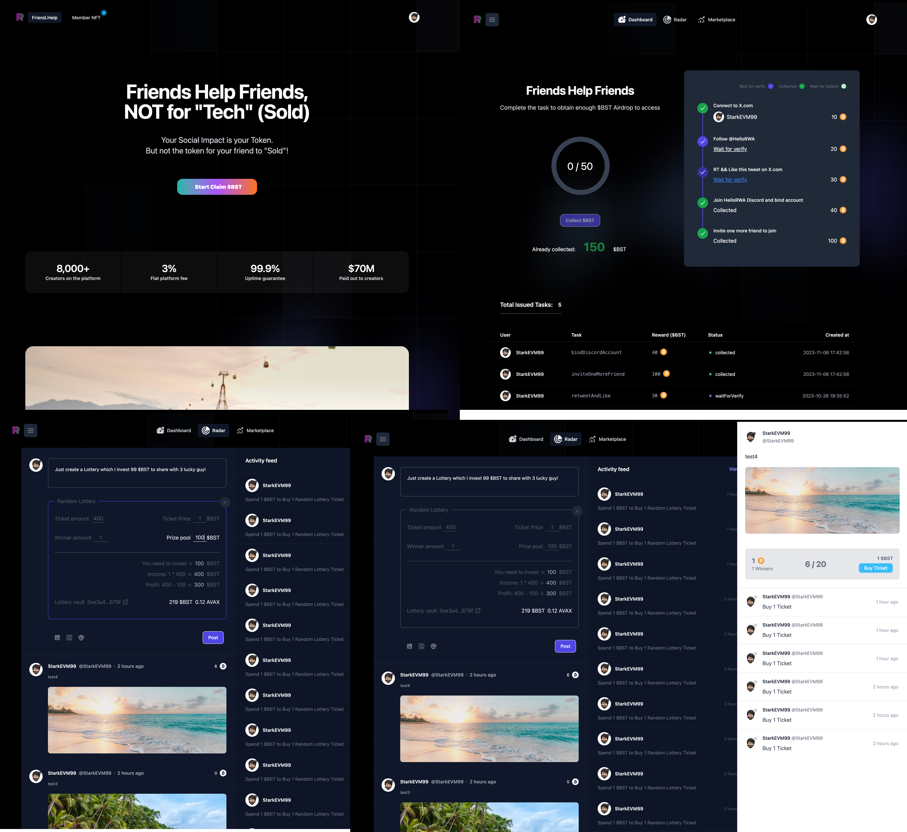
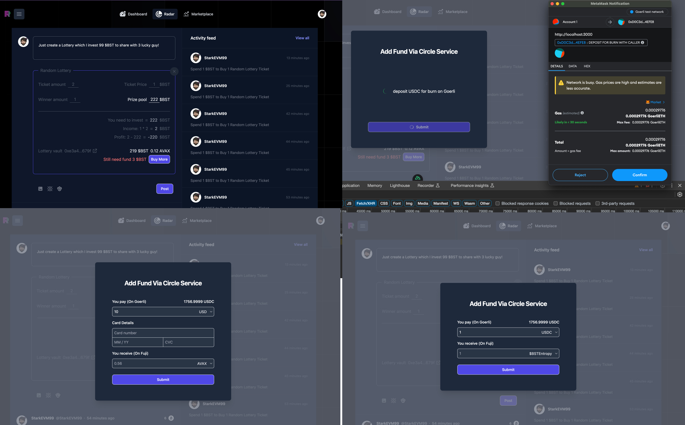

# circle-programmable-wallets-cctp

## What it does

We build a blockchain base of X.com, all the new tweets require user to pay gas and ERC20 tokens to post.
User can log in via an X.com account and our system use the MPC wallet tech to create a new wallet for the user under the hood. So users do not need to import any private key on our platform but still have a wallet to interact with blockchain.

## What do we do with Programmable Wallet and CCTP?

We use them in our *Random Lottery* module.
Users can create a new Lottery pool to attach to a new Tweet that other users can pay ERC20 tokens to buy the lottery and then get lucky.
We use programmable wallet API to create a dev-controlled programmable wallet to work as the vault of the lottery.
Also while the user lake of $BST and AVAX token, we use the *CCTP* to help the user use their *USDC on Georli* to buy *$BST and AVAX* on Fuji testnet.

* Create a new dev controlled programmable wallet and attach it to current login user
  * [Frontend code](https://github.com/HelloRWA/circle-programmable-wallets-cctp/blob/main/programmable-wallet/wallet.vue#L27-L34) && [screenshot](./screenshot/programmable-wallet-for-lottery-vault.png)
  * Frontend make request to api server which call the code in [backend api code](https://github.com/HelloRWA/circle-programmable-wallets-cctp/blob/main/programmable-wallet/walletSet.get.ts)
  * The backend code check if current login user already have the programmable wallet created first: [code](https://github.com/HelloRWA/circle-programmable-wallets-cctp/blob/main/programmable-wallet/walletSet.get.ts#L17-L40)
    * If already created, just return to frondend
    * If not, call the func [createCircleWalletRequest](https://github.com/HelloRWA/circle-programmable-wallets-cctp/blob/main/programmable-wallet/walletSet.get.ts#L43C22-L60) in [circle-sdk script](https://github.com/HelloRWA/circle-programmable-wallets-cctp/blob/main/programmable-wallet/circle-sdk.ts)
* While the user try to post a new Tweet with *Random Lottery* attached
  * it requires the user to fund enough $BST and also enough AVAX gas token in the programmable wallet
  * user can fund with their *USDC on Goerli* into *Fuji chain* via the CCTP tech
  * [fund-AVAX-via-USD.png](./screenshot/fund-AVAX-via-USD.png)
  * [fund-ERC20-via-USDC.png](./screenshot/fund-ERC20-via-USDC.png)
  * [Frontend code which request user's metamask wallet to fund with USDC on Goerli](https://github.com/HelloRWA/circle-programmable-wallets-cctp/blob/main/programmable-wallet/wallet.vue#L75-L161)
  * Backend code that delevery the $BST or AVAX gas token to the Programmable Wallet Vault
    * We use the *depositForBurnWithCaller* feature [code](https://github.com/HelloRWA/circle-programmable-wallets-cctp/blob/main/programmable-wallet/wallet.vue#L98), so we need our server side to call the *USDCMessageTransmitter.receiveMessage* method [code](https://github.com/HelloRWA/circle-programmable-wallets-cctp/blob/main/cctp/receive.post.ts#L27-L36)
* We also manual use the *circle-mint in app-sanbox* that fund our wallet with 2000 USDC on Goerli
  * Which we will integrate the feature into our product that provide user to pay via credit card to buy USDC.

## Links

* [Demo Video](#)
* [Relative Source code about Programmable Wallet](./programmable-wallet)
  * [Programmable wallet we create(link to snowtrace)](https://testnet.snowtrace.io/address/0xe3a4ee3674b7952d5f4457a94d3a3ab163e7679f)
* [Relative Source code about CCTP](./cctp)
* [Pitch Deck for RWA-Wallet.com](https://pitch.com/public/724fc677-e462-4ddc-bbb1-bb389d8ed886)

## What's next

* We still heavy build our product of RWA-Wallet.com, plan to launch it before 2023/12/01
* We also plan to use the [*Circle Mint*](https://www.circle.com/en/circle-mint) feature that we can provide our user to pay via their credit card which we need some time to setup a company in HongKong
