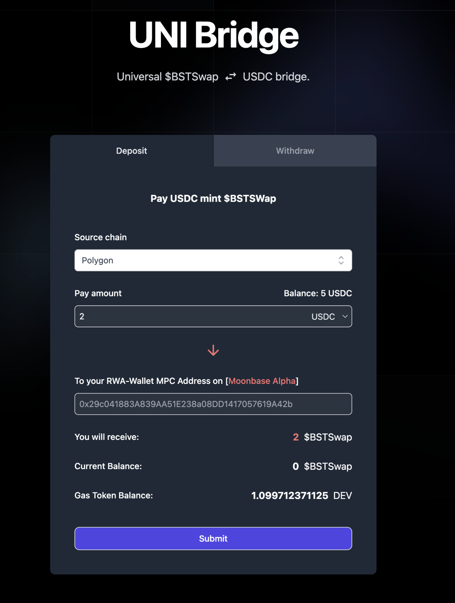

# CreatorX

## What it does

We build a blockchain base of X.com, all the new tweets require user to pay gas and ERC20 tokens to post.
User can log in via an X.com account and our system use the MPC wallet tech to create a new wallet for the user under the hood. So users do not need to import any private key on our platform but still have a wallet to interact with blockchain.

* Product link: https://RWA-Wallet.com

## What we do during the hackathon

We build a simple clone of X.com but with onchain logic, also some hack-growth logic to gain new users.

### MPC wallet for new user

* User login via X.com and platform generate a new MPC wallet for the user, so user do not need to import or record any private key anymore.
* Easier for new web2 user to use our platform, they just nearly do not need to know anything about web3/blockchain.

### Tasks system to guide new user

* User need to finish some basic tasks so they can get enough $BST to create their account onboard.
* They will need to invite a new user to get more than 100 $BST, so our user just growth fast!
* The task promote them to share/retweet on the X.com
* We also make user to bind discord account also have anti-bot setup, so only real human can use our system

We launch the module since 2024/01/01, till now get `5540 tasks` issuced and get `39,980 $BSTEntropy` token minted

* Product online link: <https://www.rwa-wallet.com/CreatorX/dashboard>
* $BSTEntropy contract link: <https://moonbase.moonscan.io/token/0xf9a9cf24921c18c896e2583c7270255dcc495c1b>

### XRC20, XRC721 to attch the hot traffic

Recently the BRC20 just so hot that have a lot of traffic. We design a XRC20/XRC721 logic and make some marketing growth these days.

* The first INDEED fair launch XRC20 that one X.com user can only mint 1 time.
* This prevent user to use any script or bot to batch mint the XRC20
* Later we will publish the XRC721 that provide every X user a ticket that can use the randomless function on moonbeam chain

the module already launch online since 2024/01/03, till now get over `3k+` X.com users and `3.589M` token minted

* Product Online link: <https://www.rwa-wallet.com/ixo/xrc20>
* XRC20 token : <https://moonbase.moonscan.io/token/0x4b3dd45716a9b38da9e44ebde981e4ade380bdcb>

### UNI-Bridge

We build a bridge that can help user to bridge their USDC from other chain into moonbeam chain.

The contract we deploy to polygon mainnet and moonbeamalpha testnet chain(so user can bridge USDC from polygon into moonbeamalpha)

* the uni-bridge on polygon mainnet: <https://polygonscan.com/address/0xf495dd8d8b4e38bdcf811b39a19eb2b1f9e24686>
* the bstswap burn/mint contract on moonbeamalpha: <https://moonbase.moonscan.io/address/0xa990281aa621569729e27b52ecb545bf54ffe2d7>

